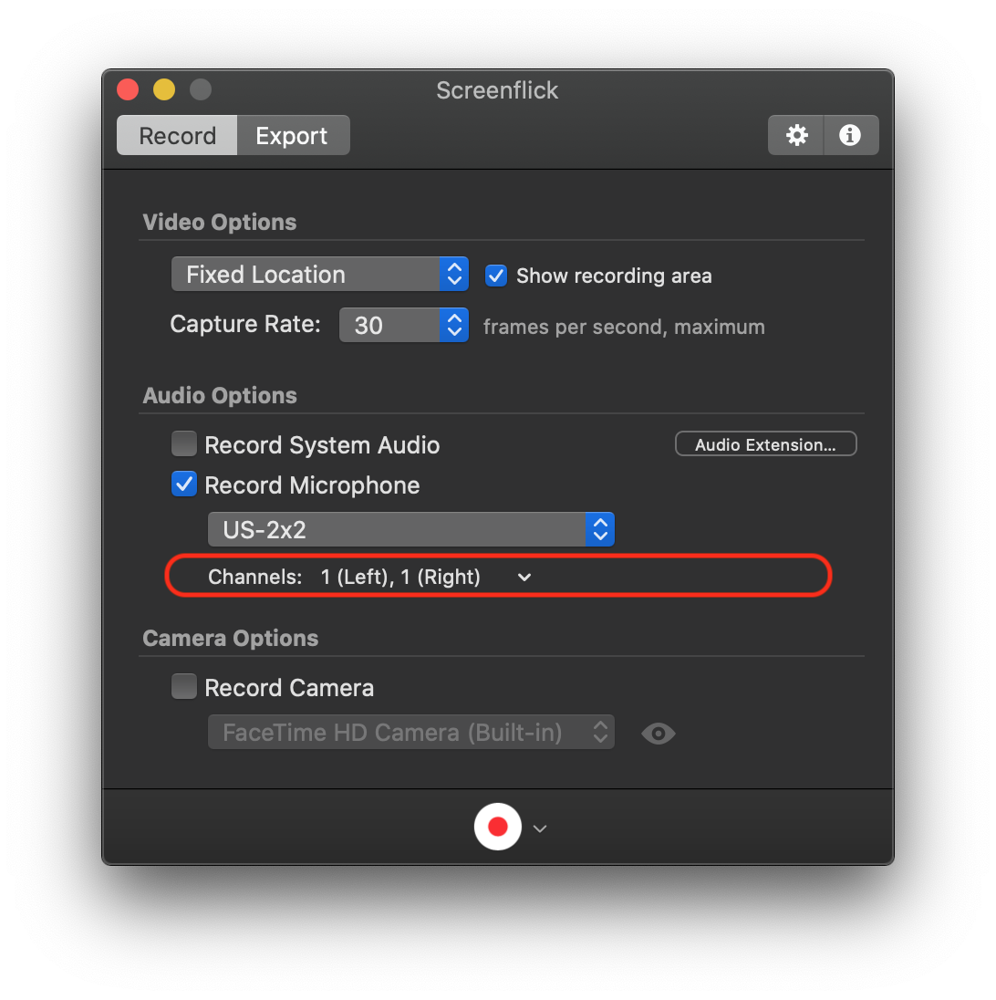

# audio-setup
A description of my audio setup for podcasting and online training videos.

## Background

I don't really know much about Audio and Video recording beyond the basics you'd need to know when for example filing a bug.
I am getting into Podcasting and Online Training videos.  Whilst on that journey, I am documenting my setup because I've
noticed that there is a lot of basic knowledge that is assumed in the manuals and forums which I don't have.  I also want
to be in a position to be able to switch computer and re-install the Operating System without losing too much configuration
nuances of my old setup.

## Resources

My first port of call was a Podcasting guide.  I used the excellent guide done by Marco Arment, [Podcasting Microphones Mega-Review](https://marco.org/podcasting-microphones)

From this I selected the following equipment:
1. [Pyle-Pro PDMIC58 Microphone with Cable](https://www.amazon.co.uk/gp/product/B003GEBGA0/ref=ppx_yo_dt_b_asin_title_o03_s00?ie=UTF8&psc=1)
1. [Tascam US-2x2 – USB Audio/MIDI Interface (2 in, 2 out)](https://www.amazon.co.uk/gp/product/B00N4LTFUI/ref=ppx_yo_dt_b_asin_title_o05_s00?ie=UTF8&psc=1)
1. [Konig & Meyer 23850-311-55 5m Microphone Desk Arm - Black](https://www.amazon.co.uk/gp/product/B00AXMLZCW/ref=ppx_yo_dt_b_asin_title_o04_s00?ie=UTF8&psc=1)
1. [Shure Bonnette pour PG-SM 48/58 black](https://www.amazon.co.uk/gp/product/B0006NMUK4/ref=ppx_yo_dt_b_asin_title_o02_s00?ie=UTF8&psc=1)

I already had a cheap set of headphones that I'd be plugging into to monitor my recordings.  I didn't realise my own headphones would need the larger Jack connector, I would be running out of USB connections on my iMac, and I also missed that I needed to attach the Microphone to the Desk Arm:
1. [Headphones Adapter, UGREEN 3.5mm to 6.35mm Stereo Aux Jack Headphone Adapter](https://www.amazon.co.uk/gp/product/B00EL9V5XW/ref=ppx_yo_dt_b_asin_title_o01_s00?ie=UTF8&psc=1)
1. [Tiger Universal Rubber Grip Microphone Clip](https://www.amazon.co.uk/gp/product/B002GOFUMQ/ref=ppx_yo_dt_b_asin_title_o00_s00?ie=UTF8&psc=1)
1. [Anker 10 Port 60W Data Hub](https://www.amazon.co.uk/gp/product/B00VE4UJD4/ref=ppx_yo_dt_b_asin_title_o01_s00?ie=UTF8&psc=1)

It seems that the Microphone and Audio/MIDI interface are so good, I don't probably need the "Bonnette" to cover the Microphone.
I went for the Dynamic Microphone route because my audio environment is not great, and I have a medium noisy mechanical keyboard so I didn't want a Condenser Microphone like the Blue Yeti which could pick that up.

# TASCAM Control Settings and Wiring

- IN1 -> Microphone
- +48V switch to Off (it means do not supply phantom power to the Microphone as some Mics need a power source)
- IN1 Gain = Almost fully turned up as it is so good, it hardly flicks on the Red Peak indicator
- MIC/Line = MIC (left position) because the Mic is not an Instrument with high impedence
- IN2 settings ignored as it is not used
- Monitor balance central = not used by me right now
- Line Out central setting = not used by me right now
- USB connector at the back = plugged into my iMac

The TASCAM control panel software can be ignored because it just adjusts the experience for the monitor headphones connected to the MIDI box, not the computer signal.

## Software

I had a colleague who recommended the [Screen Flick](https://www.araelium.com) video and Audio capture software.  It is basic to use but powerful enough to deliver the needed functionality, and is very flexible in terms of allowing you to defer decisions about mouse shown/hidden, keyboard shown/hidden until final export.

## Mono saved as Stereo tracks

My Microphone records in Mono, my Audio/MIDI box provides two channels to the computer but only one input (IN1) is used connected to the Mic.
I found two ways to get the captured audio presented as stereo to the listener.

The preferred option was to use the Record Microphone settings in the following screenshot.  These show recording from my MIDI box, called US-2x2, and using its Channel 1 (which equates to IN1 jack on the front) twice, once for the Left ear, once for the Right ear.

If that wasn't done, there is a quick way to fix it.  By using [Handbrake video transcription software](https://handbrake.fr) it is possible to use the same audio track twice.  So Track 0 feeds into Left Only ear, and Right Only ear.

